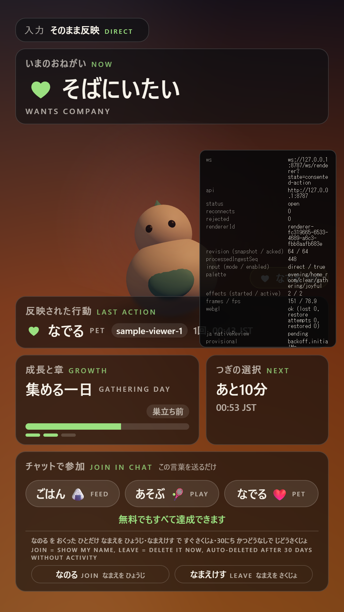

# TASK-T20c-identity-renderer

- Task: T20c identity (B) 렌더러 — 동의자 표시명·고지 CTA (`docs/tasks/TASK_SPECS.md` §T20c)
- Branch: `dnhynk/t20c-identity-renderer` · PR: #29
- Orca: task `task_f15883c91c9d` · dispatch `ctx_b0d6f01bf847`
- Spec sections read: §5.2, §5.3, §7.1, §7.4, §8.4, §8.5, §12.3, §12.4
- BOARD decisions/assumptions relied on: D-9(30일 정정 포함), A-1(부분 뒤집힘), A-9, A-11, A-15
- 계약 정본: `packages/contract/src/identity.ts`, `packages/contract/src/effect.ts`, `packages/contract/src/commands.ts` (T20a, main `c56f9d4`)
- 서버 고지문 초안: `docs/ops/identity-consent.md` §2.1 (T20b, PR #28 — 머지 전)

## Goal

동의한 시청자(`actor.kind === 'consented'`)의 표시명을 '방금 반영된 행동' 슬롯에만, 그 행동이
실제로 그 사람의 것임이 증명될 때만 붙인다. 유료 감사 연출을 포함한 나머지 화면은 지금과
똑같이 익명이고, CTA에는 "なのる로 동의한 사람만 이름이 나오고 なまえけす로 즉시 삭제되며 30일
미활동이면 자동 삭제된다"는 고지 한 줄과 두 명령 안내가 붙는다. 렌더러는 계약만으로 구현되며
`packages/contract`를 건드리지 않는다.

## Plan

1. **`apps/renderer/src/read-model/identity.ts` (신규, 순수 함수)**
   - `sanitizeDisplayName(raw)`: NFC 정규화 → 제어문자(`Cc`)·서식문자(`Cf`, 단 ZWJ U+200D는 유지)
     ·줄/문단 구분자(`Zl`/`Zp`) 제거 → 공백 축약·trim → 빈 문자열이면 `null` →
     grapheme cluster 단위 말줄임(`Intl.Segmenter`). 계약 상한
     `DISPLAY_NAME_MAX_LENGTH`(100)를 넘는 값은 렌더하지 않고 `null`(계약이 이미 막지만
     렌더러도 fail-closed).
   - `selectActionActorName(snapshot, activeEffects)`: 슬롯에 붙일 이름을 고른다.
     스냅샷에는 표시명이 없고(T20a: "표시명은 snapshot에 넣지 않는다") `ACTION_REACTION`
     effect만 `actor`를 싣기 때문에 **조인이 필요하다.** 규칙:
     활성 `ACTION_REACTION` 중 `startsAt`이 가장 큰 것 1개를 고르고(동률이 2개 이상이면 `null`),
     그 effect의 `payload.commandName`·`payload.contributionCount`가
     `display.lastAppliedAction`과 같고 `startsAt <= appliedAt`일 때만 그 effect의 `actor`를 쓴다.
     하나라도 어긋나면 이름 없음(fail-closed) — 이름을 **틀린 행동에 붙이는 것**은 §2.6이
     금지하는 가짜 참여 주장이 되므로 모호하면 익명이 정답이다.
     **→ 이 규칙은 리뷰 round 1에서 리비전(커밋) 조인으로 대체됐다.** 시간 기반 규칙은
     "snapshot이 effect보다 먼저 오는" 정상 구간에서 틀린 이름을 만들 수 있었다.
     아래 `## Review round 1` 참고.
   - 이름은 effect가 살아 있는 동안(`endsAt`까지)만 화면에 있다. 렌더러는 표시명을 따로
     기억하지 않는다 — D-9의 "철회 시 즉시 삭제"가 렌더러 쪽 잔상으로 무력화되지 않게.
2. **`Hud.tsx`**: `HudBottom`이 `actorName: string | null` prop을 받아 `slot-last-action`에
   `<span className="slot-actor">{actorName}</span>` 텍스트 노드 하나로 그린다.
   `null`이면 지금과 완전히 동일한 DOM. `dangerouslySetInnerHTML`·`innerHTML` 없음.
3. **`Screen.tsx`**: `selectActionActorName(snapshot, activeEffects)`를 호출해 `HudBottom`에 넘긴다.
4. **`Cta.tsx`**: `cta.enabled === true` 분기 안에만 고지 블록(고지 한 줄 + `JOIN`/`LEAVE` 안내)을
   추가한다. T14의 비활성(`interactionEnabled === false`) 화면에서는 CTA와 함께 사라진다.
   명령 문자열은 `CONSENT_COMMAND_ALIASES`(계약)에서만 가져온다.
5. **`i18n/ja.json`**: `ui.identity.notice`(`{join}`/`{leave}`/`{days}` 보간),
   `ui.identity.join`, `ui.identity.leave` 추가 — 전부 `nativeReview: "pending"`,
   하드코딩 일본어는 ja.json 밖에 두지 않는다.
6. **정적 검사**: `components/paid-staging.test.ts`에 `actor` 금칙 패턴 추가 + 신규
   `read-model/identity-confinement.test.ts` — 렌더러 소스 전체에서 `actor`/`displayName`을
   읽는 파일이 `read-model/identity.ts`와 그 테스트뿐임을 고정한다(§8.4 유료 연출 이름 금지).
7. **테스트**: `read-model/identity.test.ts`(정리·말줄임·조인 규칙·거부 경로),
   `Screen.test.tsx`(동의자 표시명 렌더 / 닫힘 모드 fixture에서 어떤 이름도 렌더되지 않음 /
   CTA 고지 표시·비활성 시 숨김).
8. **`?mode=dev` 대표 상태**: `testing/preview-states.ts`에 `consented-action` 1종 추가,
   `preview-states.test.ts`의 목록 갱신, `scripts/capture.mjs`에 `--only`/`--prefix` 플래그를
   더해 새 상태 한 장만 `docs/tasks/assets/`에 찍는다.
9. 게이트 5개 + 스크린샷 → PR.

## Sources consulted (official docs)

| 주제 | URL | 확인일 | 결론 |
|---|---|---|---|
| Unicode Bidirectional Algorithm의 명시적 서식 문자(LRM/RLM/ALM/LRE·RLE·PDF·LRO·RLO/LRI·RLI·FSI·PDI) 목록 | https://www.unicode.org/reports/tr9/ (UAX #9 §2 Directional Formatting Characters) | 2026-08-19 | 제거 대상 코드포인트는 U+061C, U+200E–U+200F, U+202A–U+202E, U+2066–U+2069. 전부 일반 카테고리 `Cf`에 속하므로 `\p{Cf}`(ZWJ 예외) 한 줄로 덮인다 |
| 이모지 ZWJ 시퀀스가 U+200D로 이어진다 | https://www.unicode.org/reports/tr51/ (UTS #51 §2.3 Emoji ZWJ Sequences) | 2026-08-19 | `Cf`를 통째로 지우면 이모지 이름이 깨진다 → ZWJ만 예외로 남긴다 |
| grapheme cluster 단위 분할 API | https://tc39.es/ecma402/#sec-intl-segmenter-constructor (`Intl.Segmenter`, ECMA-402) | 2026-08-19 | Node 24·Chromium 모두 지원. 말줄임이 이모지 시퀀스 중간을 자르지 않게 하는 표준 수단 |
| YouTube 채널 제목 상한 30자(표시 길이 근거 보조) | https://developers.google.com/youtube/v3/docs/channels (`brandingSettings.channel.title`) | 2026-08-19 (T20a가 확인, 이 티켓에서 재확인) | 화면 상한 20 grapheme은 문서화된 최대치보다 짧다 → 긴 이름은 말줄임된다는 사실을 테스트로 고정 |
| 동의 데이터 30일 상한 | https://developers.google.com/youtube/terms/developer-policies ([S41] III.E.4.c) | 2026-08-19 (T20b가 확인) | 고지 문구의 `{days}` = 30. BOARD D-9의 90일 정정본 |

## Questions asked (orca ask) and answers

| 질문 | 답(코디네이터) | 반영 |
|---|---|---|
| 없음 | — | 아래 Assumptions의 세 항목은 스펙·명세에 값이 없어 공식 문서 또는 D-9 문언으로 확정했고, 남은 것은 `provisional`(A-15)로 표시했다 |

## Assumptions / provisional values

| 항목 | 값 | 라벨 | 이유 |
|---|---|---|---|
| 화면 표시명 길이 상한 `DISPLAY_NAME_SCREEN_MAX_GRAPHEMES` | 20 grapheme cluster + `…` | **provisional (A-15)** | 스펙·D-9 모두 화면 폭을 정하지 않는다. 계약의 `DISPLAY_NAME_MAX_LENGTH`(100)는 주석 자체가 "저장 상한이고 화면은 T20c가 정한다"고 말한다. 20은 문서화된 유일한 채널 제목 최대치(30자)보다 짧아 대부분의 이름이 온전히 나오고 긴 이름은 잘린다. CSS `.slot-actor`(max-width)는 폭이 넓은 글리프에 대한 시각적 2차 방어일 뿐 의미상 상한은 이 상수다 |
| 이모지를 지우지 않고 유지 | 유지(제어·서식·양방향 문자만 제거) | 판단(근거 있음) | 명세의 "이모지/제어문자 정리"를 **제거**로 읽으면 이모지가 포함된 이름이 다른 사람의 이름으로 바뀌거나 통째로 사라진다(동의한 사람의 정체성을 화면이 고쳐 쓰는 셈). 위험한 것은 이모지가 아니라 재정렬·줄바꿈·터미널 제어를 하는 `Cc`/`Cf`이므로 그쪽만 제거하고, 이모지는 grapheme 단위 말줄임으로 레이아웃만 통제했다. 다르게 결정되면 `sanitizeDisplayName` 한 곳만 바꾸면 된다 |
| 표시명을 슬롯에 붙이는 조인 규칙 | 활성 `ACTION_REACTION` 중 최신 1개가 `display.lastAppliedAction`과 command·contributionCount가 같고 `startsAt <= appliedAt`일 때만 | 판단(근거 있음) | 스냅샷에는 이름이 없고(T20a) effect에만 있으므로 두 메시지를 이어야 한다. 규칙이 모호하면 이름을 **틀린 행동**에 붙이게 되고 그건 §2.6이 금지하는 가짜 참여 주장이다. 그래서 모든 애매한 경우(동률 최신 2개, 불일치, 스냅샷보다 새로운 effect)는 익명으로 떨어진다 |
| 표시명 보존 기간(렌더러 내부) | effect가 재생되는 동안만 | 판단(근거 있음) | D-9의 "철회 시 즉시 삭제"를 렌더러 잔상이 무력화하지 않게 하기 위해 별도 기억을 두지 않았다. 결과적으로 이름은 반응 연출이 끝나면 사라지고 슬롯은 익명 상태로 남는다(Follow-up에 대안 기록) |
| 고지 한 줄의 `{days}` = 30 | 30 | 결정(D-9 정정 + [S41] III.E.4.c) | 렌더러가 서버 `config/retention.json`을 읽을 수 없어 상수로 재진술했다. 30은 외부 상한이라 위로 흐를 수 없고, 서버 설정 검증이 30 초과를 막는다 |

## Result

### Acceptance criteria

`docs/tasks/TASK_SPECS.md` §T20c의 합격 기준 2개와, 디스패치 명세가 나눠 적은 범위 4개를 함께 대조한다.

| # | 기준 | 상태 | 근거(테스트 파일·명령·출력) |
|---|---|---|---|
| 1 | 표시명이 **닫힘 모드 fixture에서 절대 렌더되지 않음** | met | `apps/renderer/src/components/Screen.test.tsx` "renders no name at all on a closed-gate screen" — 닫힘 모드의 실제 wire 모양(모든 effect에 `actor` 없음)으로 스냅샷+반응+유료 연출을 보내고 `slot-last-action-actor`가 없음 + **화면 전체 textContent**에 표시명·`channelRef`가 없음을 확인. 선택자 수준은 `apps/renderer/src/read-model/identity.test.ts` "shows no name while the gate is closed, whatever else is on screen"·"shows no name for a viewer who has not opted in" |
| 1 | **유료 연출 컴포넌트가 `actor`를 읽지 않음(정적 검사)** | met | `apps/renderer/src/components/paid-staging.test.ts` — 금칙 패턴에 `\bactor\b` 추가(`PaidThanks.tsx`, 그리고 신규 "draws the free reaction chips without a name either"로 `EffectLayer.tsx`도). 더 넓게 `apps/renderer/src/read-model/identity-confinement.test.ts`가 **워크스페이스 전체**에서 `actor` 필드를 읽는 파일이 `read-model/identity.ts`뿐임을 고정하고, `src/components/**`(비테스트) 전체에 `actor`·`displayName`이 0건임을 따로 검사한다. 컴포넌트 목록이 아니라 필드 이름을 검사하므로 새 컴포넌트가 생겨도 자동으로 걸린다 |
| 2 | **ja.json 키 전부 `nativeReview: pending`** | met | `apps/renderer/src/i18n/japanese-source.test.ts` "is marked as awaiting native review, entry by entry"(기존 테스트, 신규 3키 포함해 통과). 신규 키: `ui.identity.notice`·`ui.identity.join`·`ui.identity.leave` |
| 2 | **하드코딩 일본어 0건** | met | 같은 파일 "contains no hard-coded Japanese outside ja.json". 명령 문자열(`なのる`/`なまえけす`)은 계약의 `CONSENT_COMMAND_ALIASES`에서만 오고, 고지 문장은 ja.json이 `{join}`/`{leave}`/`{days}`로 보간한다 |
| 범위 1 | '방금 반영된 행동' 슬롯에 `actor.kind==='consented'`일 때만 표시명 | met (round 2에서 규칙 교체) | `read-model/identity.ts`(`trackActionRevision` + `selectActionActorName`) + `Hud.tsx`(`slot-actor`). 조인 키는 두 메시지가 나온 **커밋(`stateRevision`)**이며, 그 리비전의 후보가 정확히 1개일 때만 이름이 붙는다. `identity.test.ts`의 `selectActionActorName` 14개 + `trackActionRevision` 4개 케이스, `store.test.ts`의 `ReadModel action revision` 5개가 성공·거부 경로를 함께 고정한다(snapshot 선행, effect 선행, 재전송, A→B 연속, 한 커밋 2건, 리비전 건너뜀, 명령·횟수 불일치). `actor=null`이면 DOM이 이전과 동일(`Screen.test.tsx` "draws the four fixed slots from snapshot.display" 무변경 통과). **round 1의 시간 기반 규칙은 틀린 이름을 만들 수 있었다 — `## Review round 1` 참고** |
| 범위 1 | 길이 제한·이모지/제어문자·양방향 제어문자 정리, React 텍스트 노드로만 렌더 | met | `sanitizeDisplayName`(`identity.ts`) + `identity.test.ts`의 `sanitizeDisplayName` 11개 케이스(round 2에서 code point 상한·astral 경계 1건 추가)(양방향 4종·제어/서식 4종·공백 접기·빈 결과·grapheme 말줄임·계약 상한 초과 거부·markup 미해석). 텍스트 노드는 `Screen.test.tsx`가 `firstChild.nodeType === Node.TEXT_NODE`로 확인하고, `identity-confinement.test.ts`가 렌더러 전체에 `dangerouslySetInnerHTML`/`innerHTML =`/`insertAdjacentHTML`/`document.write`가 0건임을 고정 |
| 범위 2 | 유료 감사 연출·다른 effect에 이름 없음, 지출·참여 순위표 없음 | met | 위 정적 검사 2개 + `Screen.test.tsx` "keeps the name off the paid staging and off the reaction chip". 순위표는 애초에 없고 `paid-staging.test.ts`의 `a ranking` 패턴이 계속 0건 |
| 범위 3 | CTA 고지 한 줄(ja 주 표기 + en 별칭) + JOIN/LEAVE 안내, T14 CTA 비활성 시 함께 숨김 | met (round 2에서 영어 보강) | `Cta.tsx`의 `cta-identity` 블록(활성 분기 안에만 존재). `Screen.test.tsx` "states how a name gets on screen and how it comes off, next to the CTA"(일본어·영어 **양쪽** 문구가 ja.json + 계약 별칭 + `CONSENT_RETENTION_DAYS`의 보간 결과와 정확히 일치하고, 영어 줄이 LEAVE 삭제와 30일을 실제로 말하는지 DOM 텍스트로 확인)와 "withdraws the consent notice together with the CTA"(`interactionEnabled:false`에서 `cta-identity`·`cta-identity-notice`·`cta-consent-command-JOIN` 전부 없음) |
| 범위 4 | `?mode=dev` 대표 상태 1종 추가 + 스크린샷 | met | `testing/preview-states.ts`의 `consented-action`, `preview-states.test.ts` "shows a consented viewer only where D-9 allows one"(이름 있는 effect가 정확히 1개, 조인이 성립하는 조합, 나머지 6개 상태는 전부 익명). 스크린샷 `docs/tasks/assets/TASK-T20c-dev-consented-action-1080x1920.png`(아래) |

### Gates (executed)

```text
git fetch origin && (soft-reset rebase onto origin/main 00ebc42 — 아래 "정직성 메모")
npm run format:check -> All matched files use Prettier code style!
npm run lint         -> eslint 0 problems; check-no-legacy-imports: ok (0 legacy imports);
                        check-install-scripts: ok (4 reviewed, better-sqlite3 binding loads)
npm run typecheck    -> tsc --build tsconfig.json, 오류 0
npm run test         -> Test Files 141 passed (141), Tests 1991 passed | 1 skipped (1992)
npm run build        -> @vl/contract, @vl/renderer, @vl/server, @vl/simulator, @vl/soak 성공

npm run build -w @vl/renderer
  dist/assets/index-*.js 1,210 kB (gzip 342 kB)  — T14 이후 그대로, 이 PR로 늘지 않음
node apps/renderer/scripts/capture.mjs --only consented-action --prefix TASK-T20c --measure-ms 3000
  chrome: C:/Program Files/Google/Chrome/Application/chrome.exe
  dev/consented-action: stage 1080x1920, canvas 1080x1920, slots 4
    -> docs/tasks/assets/TASK-T20c-dev-consented-action-1080x1920.png
  frame budget: 279 frames in 3.0s = 92.9 fps at 1080x1920 (headless, software WebGL; 4 health frames)
  wrote 1 screenshots to docs/tasks/assets
```

정직성 메모 3개:

1. `prettier --check .`는 로컬 도구가 만드는 `.impeccable/hook.cache.json`(이 저장소 산출물 아님)까지 훑는다. 그 캐시를 지운 뒤의 결과가 위 출력이다. 작업 도중 그 파일이 실수로 두 커밋에 들어갔고, 브랜치를 `origin/main` 위에서 다시 쌓아 **PR diff에는 남지 않는다**(`git diff --name-only origin/main`에 없음).
2. rebase는 `git rebase origin/main`이 위 캐시 파일 때문에 멈춰서(`untracked working tree files would be overwritten`) `git reset --soft origin/main` 후 3개 커밋으로 다시 쌓았다. 그 과정에서 `docs/tasks/BOARD.md`가 옛 버전으로 되돌아갈 뻔했으나 `git checkout origin/main -- docs/tasks/BOARD.md`로 복구했고, 최종 diff에 BOARD.md는 없다.
3. **실행하지 않았음**: 실제 OBS Browser Source 육안 확인(호스트 OBS 기동은 T2/T17·Gate 2 항목이며 이 PR의 합격 기준이 아니다). GPU 브라우저에서의 FPS 측정도 하지 않았다(headless software WebGL만). 원어민 검수(§5.3, Gate 3)도 하지 않았다 — 신규 3키 전부 `nativeReview: "pending"`.

### Screenshot



'반영された行動' 슬롯에 `sample-viewer-1` pill이 붙고, CTA 아래에 고지 한 줄(ja 1줄 + en 별칭)과
`なのる`/`なまえけす` 안내가 붙는다. 오른쪽 검은 패널은 `?mode=dev` 진단 패널이며 `?mode=broadcast`에는
없다(T14 follow-up: 패널이 슬롯 위를 덮는 문제는 이 PR 범위 밖이며 그대로다).

## Review round 1

리뷰(`gh pr view 29 --json reviews`, 2026-08-19, verdict **request_changes**) — blocker 1 + major 1 +
minor 1. **셋 다 타당하다**고 판단해 전부 고쳤고, 반박한 항목은 없다. 이 라운드에서도
`packages/contract`는 건드리지 않았다(계약 변경이 필요한지는 blocker 항목에서 따로 따진다).

| # | 지적 | 판단 | 무엇을 고쳤나 | 고침 SHA |
|---|---|---|---|---|
| blocker | `read-model/identity.ts:185` — 조인에 인과/리비전 키가 없다. '현재 수신된 가장 새 반응'을 명령·횟수와 `startsAt <= appliedAt`으로만 고르는데, 서버는 snapshot을 effect보다 **먼저** 발행하므로(`apps/server/src/engine/engine.ts:1182`·`:1192`) 시청자 A의 아직 재생 중인 이름 붙은 FEED/1 반응이 시청자 B의 새 snapshot에 귀속된다(리뷰어 재현: `delayedAckSelection='viewer-A'`). 스펙 §2.6이 금지하는 가짜 귀속 | 타당 | 조인 키를 **커밋(`stateRevision`)**으로 바꿨다. 아래 상세 | `4718187` |
| major | `i18n/ja.json:32` — 영어 고지가 `YOUR NAME IS SHOWN ONLY IF YOU OPT IN`뿐이라, LEAVE 즉시 삭제와 30일 자동 삭제가 영어에는 없다. PR #28 `docs/ops/identity-consent.md` §2.1(`JOIN = show my name · LEAVE = delete it`)과도 어긋난다 | 타당 | 영어 별칭이 일본어와 **같은 세 가지**를 말하도록 고치고, 명령 문자열과 30을 영어 쪽에서도 계약·상수에서 보간하도록 `Alias`에 params를 붙였다. 렌더된 DOM 텍스트로 단언 | `920521f` |
| minor | `identity.ts:106` — `raw.length`는 UTF-16 code unit이고 계약 `DisplayNameSchema`는 `u` 플래그 아래 code point를 센다. 이모지 60개(120 code unit / 60 code point)는 계약이 받아들이는데 렌더러가 거부한다 | 타당 | 상한을 계약과 같은 단위(code point)로 재고, 그 뒤 20 grapheme 말줄임. astral 경계 테스트 추가 | `80fa2a2` |

### blocker 1 — 조인 키를 '시간'에서 '커밋'으로

**왜 시간으로는 안 되는가.** 4초짜리 반응 연출 창 안에서 두 시청자가 같은 명령을 보내면, 두
행동을 구분하는 정보가 `commandName`·`contributionCount`·`startsAt`에는 없다. 도착 순서도
소용이 없다 — 서버는 커밋의 snapshot을 그 커밋의 effect보다 먼저 내보내므로, "새 snapshot이
왔는데 그 effect는 아직"인 구간이 정상 동작에 항상 존재한다. 그 구간에서 옛 이름이 새 행동에
붙었다.

**무엇으로 대신하는가.** `Effect.stateRevision`은 "그 effect를 만든 커밋의 리비전"이고
(`packages/contract/src/effect.ts:79`), 서버는 `ACTION_REACTION` 초안을 push하는 것과
`lastAppliedAction`을 쓰는 것을 **한 reduction 안에서** 한다
(`apps/server/src/world/reducer.ts:629`·`:641`). `engine/effects.ts:49`와 `engine/snapshot.ts:38`이
둘 다 같은 `context.revision`을 찍는다. 그러므로 화면에 있는 행동의 반응은 **그 행동이 나타난
리비전을 정확히 들고 있다.**

snapshot 하나만으로는 그 리비전을 알 수 없다 — 이후 snapshot들은 바뀌지 않은
`lastAppliedAction`을 자기 리비전으로 계속 반복한다. 그래서 `ReadModel`이 스냅샷 **열**을 보고
"`lastAppliedAction`이 마지막으로 바뀐 리비전"을 들고 있고(`trackActionRevision`), 조인은

- `effect.kind === 'ACTION_REACTION'`
- `effect.stateRevision === actionRevision`
- `commandName`·`contributionCount` 일치
- 그런 후보가 **정확히 1개**

일 때만 이름을 붙인다. 0개 또는 2개 이상이면 익명이다(한 커밋이 구분 불가능한 행동 2건을
적용했다면 어느 쪽 이름을 골라도 추측이다).

**세 가지 경계 상황을 따져 보면(디스패치 요구):**

| 상황 | actionRevision | 결과 | 왜 안전한가 |
|---|---|---|---|
| 첫 snapshot(로드·재연결, 이전 상태 없음) | 그 snapshot의 리비전 | 같은 커밋의 반응만 이름이 붙는다 | 그 리비전을 든 `ACTION_REACTION`은 **그 커밋이 만든 것**이고, 그 커밋이 곧 지금 보이는 `lastAppliedAction`을 쓴 커밋이다. 재전송돼 아직 재생 중인 옛 반응은 **더 낮은** 리비전을 들고 있어 후보가 되지 못한다. snapshot의 행동이 실제로 snapshot보다 오래된 것이면 후보가 0개 → 익명 |
| 재연결 | 위와 동일(첫 snapshot이다) | 대개 익명 | 서버가 보내는 현재 snapshot의 리비전은 보통 행동이 적용된 리비전보다 크므로, 재전송된 반응(옛 리비전)과 맞지 않는다 |
| coalesce·stale drop으로 리비전을 건너뜀(§10.2) | **본** 리비전(실제보다 나중) | 익명 | 실제 반응은 건너뛴 리비전을 들고 있어 후보가 0개가 된다 |

즉 세 경우 모두 **틀린 이름이 아니라 이름 없음**으로 떨어진다. 반대 방향(이름이 안 나오는
손해)은 감수한다 — 화면은 익명 상태에서 이미 정확하지만, "누가 했는지 틀린" 상태에서는 정확하지
않기 때문이다(§2.6).

**남는 가정 1개(계약이 아니라 서버 구현에 기대는 부분).** "한 커밋이 `ACTION_REACTION`을
staging했다면 그 커밋이 `lastAppliedAction`도 그 명령·횟수로 썼다"는 것. 지금 서버는
`ACTION_REACTION`을 만드는 자리가 `reducer.ts:629` 한 곳뿐이고 12줄 뒤에서
`lastAppliedAction`을 쓰므로 성립한다(`rg "ACTION_REACTION" apps/server/src`로 확인). 계약에
`display.lastAppliedAction.stateRevision`(또는 `eventKey`)이 생기면 이 추론 자체가 없어지므로
follow-up으로 남긴다 — 다만 그것은 `[contract]` 변경이라 이 task에서 하지 않는다.
**지금 방식으로도 리뷰어의 재현 시나리오는 사라지고, 어떤 경계에서도 틀린 이름이 나오지 않는다**고
판단해 `ask` 없이 구현했다.

**회귀 테스트(디스패치가 요구한 6가지 전부).**

| 시나리오 | 테스트 |
|---|---|
| snapshot이 effect보다 먼저(리뷰어 재현) | `identity.test.ts` "does not lend a viewer name to the next action whose snapshot arrives first" · `Screen.test.tsx` "does not lend a name to the next action whose snapshot arrives first (BOARD D-9)" (DOM 수준) |
| ACK 지연 | 같은 `Screen.test.tsx` 케이스 — `frame()`을 한 번도 돌리지 않아 state·effect ACK가 나가지 않은 상태에서 검증한다 |
| 재전송(repeat) | `identity.test.ts` "survives a retransmitted reaction, which is one effect twice" + 위 `Screen.test.tsx` 케이스 마지막 단계 |
| 두 effect 연속(A→B) | `identity.test.ts` "follows two named actions in a row, one commit at a time" · `Screen.test.tsx` "names the next consented viewer once their own commit is on screen" |
| 같은 리비전에 같은 명령 2건 | `identity.test.ts` "refuses to choose between two reactions from the same commit" |
| effect가 snapshot보다 먼저 | `identity.test.ts` "shows no name for a reaction that arrives before the snapshot it belongs to" |
| 리비전 건너뜀(coalesce) | `identity.test.ts` "shows no name when a revision was skipped, rather than guessing at it" |
| 키 자체의 동작 | `identity.test.ts` `describe('trackActionRevision')` 4건 · `store.test.ts` `describe('ReadModel action revision')` 5건(첫 snapshot, 불변, 이동, 비움, stale drop) |

### 이전 `## Result`의 부정확한 서술 정정

리뷰어가 "`## Result`가 조인을 fail-closed/met으로 선언했지만 snapshot-before-effect
반례에서는 틀린 이름이 나온다"고 지적했다. **맞다.** 아래 acceptance 표의 '범위 1' 행과
follow-up 한 줄은 round 1 기준으로는 사실이 아니었고, 이 라운드에서 코드가 그 서술에 맞게
고쳐졌다. 표와 follow-up도 새 규칙으로 갱신했다.

### Gates (round 2, executed)

```text
git fetch origin && git rebase origin/main   -> Successfully rebased (origin/main e9e93d9)
npm run format:check -> All matched files use Prettier code style!
npm run lint         -> eslint 0 problems; check-no-legacy-imports: ok (0 legacy imports);
                        check-install-scripts: ok (4 reviewed, better-sqlite3 binding loads)
npm run typecheck    -> tsc --build tsconfig.json, 오류 0
npm run test         -> Test Files 141 passed (141), Tests 2006 passed | 1 skipped (2007)
npm run build        -> @vl/contract, @vl/renderer, @vl/server, @vl/simulator, @vl/soak 성공

node apps/renderer/scripts/capture.mjs --only consented-action --prefix TASK-T20c --measure-ms 3000
  dev/consented-action: stage 1080x1920, canvas 1080x1920, slots 4
  frame budget: 43 frames in 3.0s = 14.3 fps at 1080x1920 (headless, software WebGL)
```

스크린샷은 다시 찍었다. 고지 영어 줄이 바뀌었기 때문이고, 같은 이미지에서 `sample-viewer-1`
pill이 여전히 슬롯에 붙어 있는 것이 리비전 조인이 실제 렌더러에서도 성립한다는 증거다.
FPS 수치가 round 1(92.9)보다 낮은 것은 같은 headless software WebGL 환경의 부하 차이이며 이
PR의 변경과 무관하다(측정 자체가 이 task의 합격 기준이 아니다 — T14·T17 항목).

**실행하지 않았음**: 실제 OBS Browser Source 육안 확인, GPU 브라우저 FPS, 일본어 원어민 검수
(round 1과 동일한 이유·범위).

## Not done / out of scope

- `packages/contract` 미변경(`[contract]` task 아님). 표시명·`channelRef`·동의 명령 별칭은 T20a가 이미 넣어 둔 것을 읽기만 했다.
- 서버 쪽(T20b, PR #28)은 건드리지 않았다. 이 PR은 계약만 보고 구현했고, `docs/ops/identity-consent.md` §2.1의 고지 초안과 **같은 취지**의 문구를 쓰되 T20c 명세가 요구한 3가지(동의자 한정·즉시 삭제·30일 미활동 자동 삭제)를 한 줄에 모두 담았다. round 2에서 영어 별칭도 같은 3가지를 말하게 고쳤다(`JOIN = SHOW MY NAME, LEAVE = DELETE IT NOW, AUTO-DELETED AFTER 30 DAYS WITHOUT ACTIVITY`). 초안 §2.1은 앞의 2개만 담고 있으므로 문구가 문자 그대로 같지는 않다.
- 동의자 한정 cooldown·한 표(A-9)·분기 투표는 서버 쪽 결정이라 렌더러에 아무 것도 넣지 않았다. `ChoiceOptionView.commandName`은 서버가 넣어 줄 때만 표시되는 기존 동작 그대로다.
- 유료 연출·순위표·지출 표시는 손대지 않았다. `PaidThanks.tsx`는 한 글자도 바뀌지 않았고 정적 검사만 강화했다.
- 원어민 검수·문안 확정은 Gate 3(A-11).

## Follow-ups

- **이름이 반응 연출(4초)과 함께 사라진다.** 슬롯은 그 뒤로도 같은 행동을 익명으로 계속 보여 준다. D-9의 "철회 시 즉시 삭제"를 렌더러가 흐리지 않게 하려고 일부러 아무 것도 기억하지 않은 결과다. 이름을 더 오래 두고 싶다면 (a) 서버가 `display.lastAppliedAction`에 `actor`를 실어 주고(계약 변경, `[contract]`) (b) 철회 시 서버가 즉시 새 snapshot을 내는 쪽이 옳다 — 렌더러가 자체 캐시로 늘리는 것은 삭제 보장을 깨므로 권하지 않는다.
- **조인은 `stateRevision`으로 하지만, 계약에는 아직 "이 행동이 어느 커밋에서 적용됐는가"를 말하는 필드가 없다.** 렌더러는 snapshot 열을 보고 그것을 추론한다(`trackActionRevision`). 그래서 (a) 재연결·coalesce 뒤 첫 이름 한 번은 익명이 되고, (b) "한 커밋이 `ACTION_REACTION`을 만들었다면 그 커밋이 `lastAppliedAction`도 썼다"는 서버 구현상의 사실에 기댄다. `display.lastAppliedAction`에 `stateRevision`(또는 `eventKey`)을 얹는 `[contract]` 변경 하나면 추론이 사라지고 (a)도 없어진다 — 코디네이터가 분리한다면 T20d 후보다.
- `scripts/capture.mjs`에 `--only`/`--prefix`를 더했다(대표 상태 1장만 다시 찍기 위해). 기본값은 T14와 동일해서 기존 사용법은 그대로다.
- `.impeccable/`(로컬 도구 캐시)는 저장소에 들어가면 안 되는데 `.gitignore`에 없다. 다른 worker도 같은 실수를 할 수 있으므로 별도 정리 task로 남긴다.
- `?mode=dev` 패널이 '반영された行動' 슬롯을 가리는 문제는 T14에서 이미 follow-up으로 적혀 있고 그대로다.
